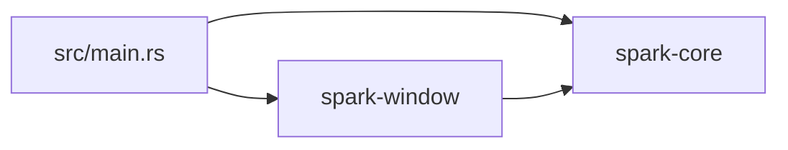

<!--
Spark PR template. Keep sections short. Use the expandable <details>
blocks for anything optional — they keep the PR description scannable
while preserving full context for reviewers and future readers.

Required for *every* PR:
  - Summary (1–3 bullets)
  - Context (why this change exists; link the issue)
  - Changes (what changed, file-by-file or area-by-area)
  - Test plan (mark-tickable list)
  - Checklist

Required for PRs that change module structure, public APIs, data flow,
introduce a new pattern, or introduce a new dependency:
  - Architecture diagrams (the <details> block below — ASCII or mermaid)
  - Learn section (Rust + engine concepts used, for a 14-year-old reader)

Delete sections that genuinely don't apply to your PR (e.g. "Learn"
for a typo-fix). Don't leave empty headings behind.
-->

## Summary

<!-- 1–3 bullets, plain language. What changed and why. -->

-
-

## Context

<!-- Why this change exists. Link the issue: "Closes #123" / "Refs #45". -->

Closes #

## Changes

<!-- File-by-file or area-by-area breakdown. Be concrete: paths + what changed. -->

-
-

<details>
<summary><strong>Architecture diagrams</strong> — required for structural / API / data-flow changes</summary>

<!--
Use ASCII diagrams in a ```text fenced block, or mermaid in a ```mermaid block.
At least one of:
  - Dependency graph (before → after)
  - Data flow / control flow
  - Module layout
  - Sequence diagram

Example (mermaid):



Example (ASCII):

```text
                 ┌──────────────┐
                 │  spark (bin) │
                 └───┬──────────┘
                     │
       ┌─────────────┴─────────────┐
       ▼                           ▼
 ┌──────────────┐         ┌──────────────┐
 │ spark-core   │◀────────│ spark-window │
 └──────────────┘         └──────────────┘
```
-->

</details>

<details>
<summary><strong>Learn — Rust and engine concepts used in this PR</strong> — required for new patterns / new deps / new language features</summary>

<!--
Audience: a 14-year-old learning Rust + game engines. Cover every non-obvious
language feature and every architecture concept this PR introduces. Each item:
  - One paragraph plain-English explanation, AND
  - A short runnable snippet that demonstrates it (where it makes sense).

Rust-feature topics to cover when relevant:
  - traits / trait objects (`Box<dyn Trait>`) / dynamic vs static dispatch
  - `impl Trait` in argument vs return position
  - the `?` operator + `From` conversion (especially for error types)
  - `#[non_exhaustive]`, `#[derive(...)]`, `#[must_use]`
  - lifetimes / `'static` bounds
  - `pub use` re-exports vs `pub type` aliases
  - `Send + Sync` markers
  - closures (`Fn` / `FnMut` / `FnOnce`)
  - const generics, GATs, async, etc. if used

Architecture-concept topics to cover when relevant:
  - plugin pattern / stages / lifecycle
  - dependency direction & cycles
  - error-handling roles (thiserror inside libs, anyhow at the engine boundary)
  - workspace organisation, pinned versions
  - ECS Resources vs Entities (once ECS lands)
-->

</details>

## Test plan

- [ ] `cargo fmt --all -- --check`
- [ ] `cargo build --workspace`
- [ ] `cargo clippy --workspace --all-targets --all-features -- -D warnings`
- [ ] `cargo test --workspace`
- [ ] `cargo run -p spark` exercises the change manually (describe what to look for)

<details>
<summary>Manual verification notes</summary>

<!-- What did you actually click / press / observe? Screenshots welcome. -->

</details>

## Risks & rollback

<!-- One sentence on what could go wrong + how to undo this PR if it does. -->

## Checklist

- [ ] Rustdoc updated for every changed item per CLAUDE.md tiered policy (Tier 1/2/3)
- [ ] `CLAUDE.md` / `docs/PLAN.md` updated if a convention or milestone shifted
- [ ] No `unsafe` introduced without explicit profiling justification
- [ ] No `Box<dyn Error>` in any public API surface
- [ ] `use` statements at the top of files; no fully-qualified `spark_*::Foo::bar()` at call sites
- [ ] All deps pinned to exact patch versions in `[workspace.dependencies]`
- [ ] No TODOs left behind without a tracking issue link
- [ ] PR title is concise (< 70 chars); detail lives in this description
