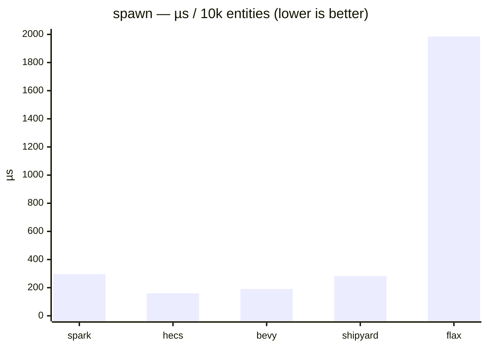
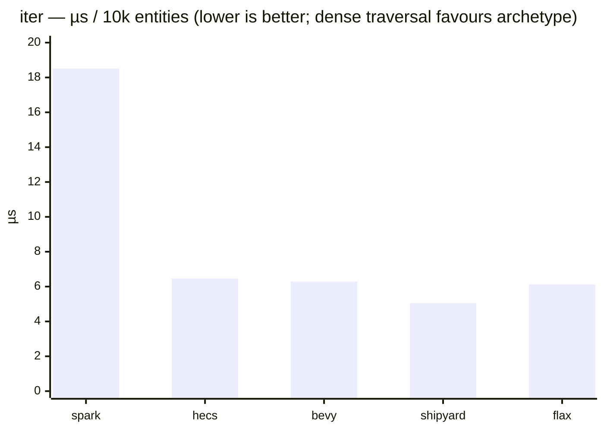
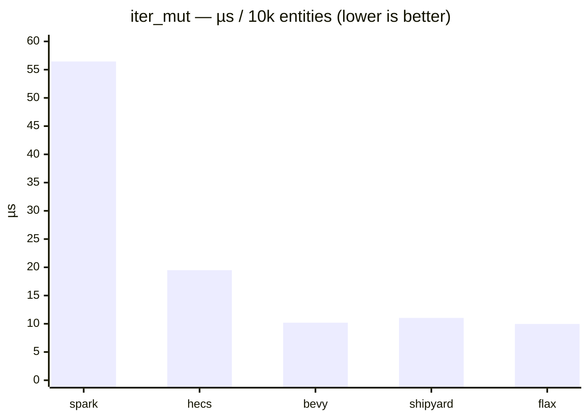
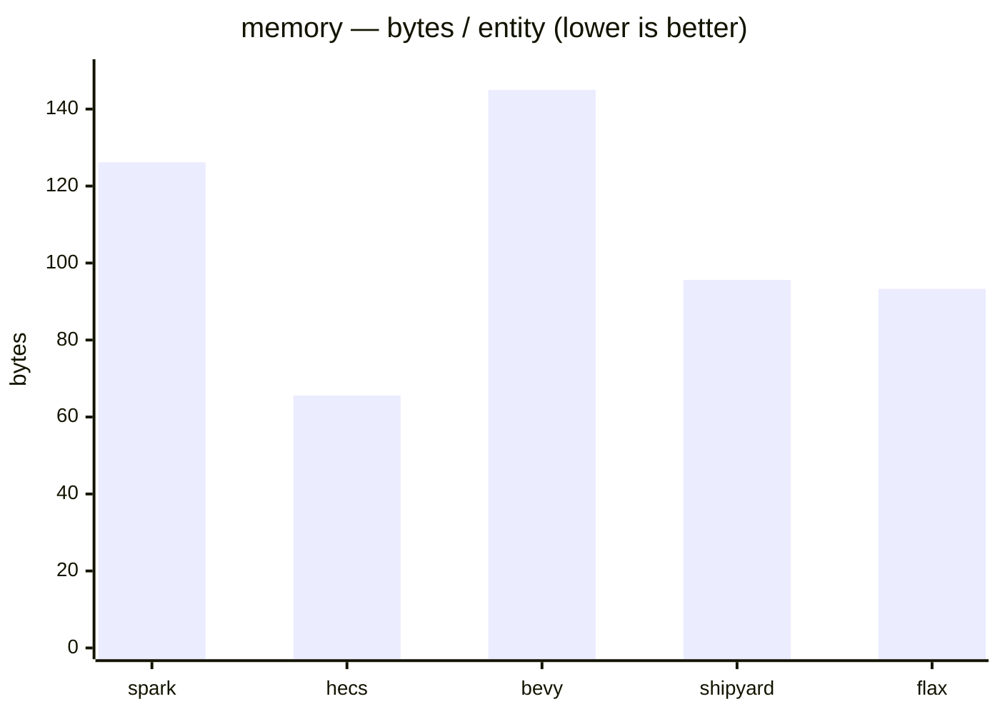
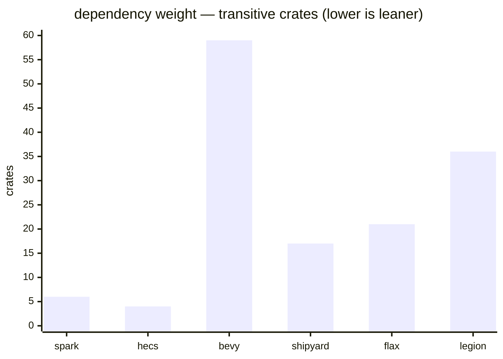
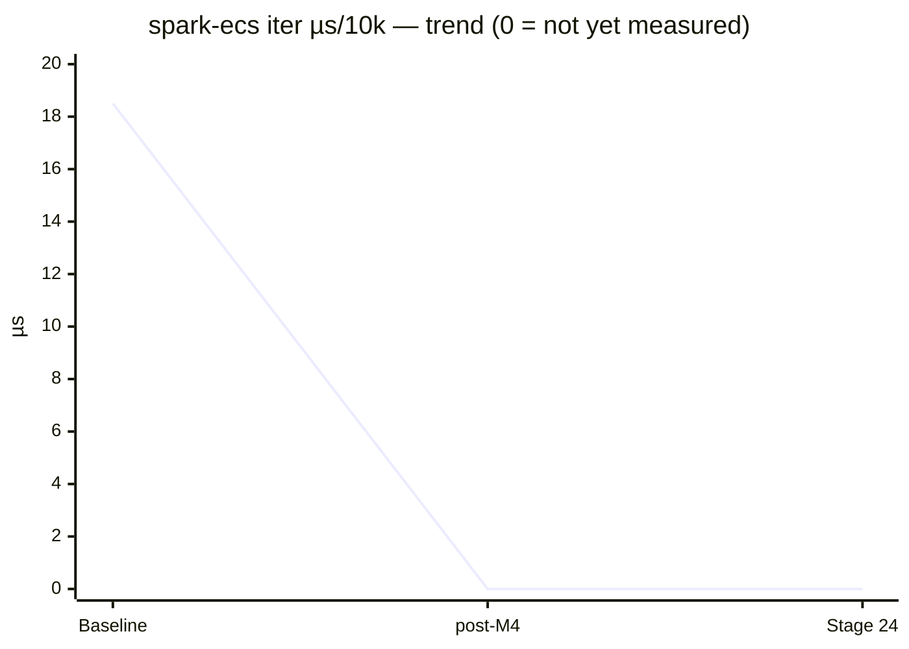

# Baseline 2026-05-31 (post-#62, single-threaded)

Single-threaded `spark-ecs` at current `main` (`bbb0e5d`, post-PR #62) against
four rival ECS, on four metric axes: **time**, **throughput**, **live-heap
memory**, **dependency weight**.

Architecture spread — **sparse-set:** `spark-ecs`, `shipyard` · **archetype:**
`bevy_ecs`, `hecs`, `flax`.

Each timing bench is one full pass over **10 000 entities** (`Position` +
`Velocity`); numbers are **µs per pass**. Three `cargo bench` launches; tables
show the median point estimate with [min–max]. Captured on an active developer
machine (best-effort quiet), not an isolated rig.

## Scope & caveats — read before the numbers

This baseline measures **one of two axes, on the workload least favourable to
spark-ecs's architecture.** Both qualifications matter:

### 1. Single-threaded only — this is *not* "the gap with bevy"

Every number here is single-threaded. `spark-ecs` has no parallel scheduler yet
(Rayon arrives in **M4**); `bevy_ecs`'s *defining* strength — its parallel
system scheduler — is **also switched off here**. So the traversal comparison is
single-thread-vs-single-thread: an honest snapshot of *where spark-ecs is
today*, but it must **not** be read as the real bevy gap. bevy's true advantage
shows under multi-threaded scheduling, which neither side exercises. This is
**half the story** — the parallel axis lands in the post-M4 re-run.

### 2. Dense-traversal workload favours archetype ECS

The workload is a single archetype shape (one `Position`+`Velocity` combo), a
single size (10 000), and **pure dense traversal**. That is precisely the
scenario archetype ECS (`bevy_ecs`/`hecs`/`flax`) are *best* at and sparse-set
ECS (`spark-ecs`/`shipyard`) are *worst* at. The sparse-set structural
advantage — cheap component `insert`/`remove` with **no** archetype moves — is
**not measured here at all**. So spark-ecs's `iter` deficit below is measured on
the discipline least flattering to its design; the numbers aren't wrong, they're
a slice selected (unintentionally) in archetype's favour.

**Not yet measured (planned follow-ups):**

- varying N (1k / 100k) → cache-scaling behaviour
- fragmented archetypes (many distinct shapes) → archetype pays for transitions
- frequent `insert`/`remove` churn → the scenario where sparse-set should *win*
- multi-threaded scheduling (post-M4) → the other half of the story

## Time (median µs per 10k-entity pass, lower is better)

| Bench      | spark-ecs               | hecs                    | bevy_ecs                | shipyard                | flax                       |
| ---------- | ----------------------- | ----------------------- | ----------------------- | ----------------------- | -------------------------- |
| `spawn`    | 297.12 [288.25–305.64]  | 160.36 [157.97–163.16]  | 190.50 [180.41–206.29]  | 282.71 [279.37–290.73]  | 1985.4 [1969.7–1989.9]     |
| `iter`     | 18.503 [18.182–18.656]  | 6.4576 [6.2683–6.4613]  | 6.2871 [6.1458–6.3414]  | 5.0457 [5.0423–5.0622]  | 6.1293 [6.0448–6.1800]     |
| `iter_mut` | 56.449 [55.941–56.566]  | 19.494 [19.344–19.704]  | 10.188 [10.174–10.301]  | 11.039 [10.908–11.080]  | 9.9655 [9.9643–10.032]     |

## Throughput (entities / µs = Melem/s, higher is better)

| Bench      | spark-ecs | hecs | bevy_ecs | shipyard | flax     |
| ---------- | --------- | ---- | -------- | -------- | -------- |
| `iter`     | 540       | 1548 | 1590     | **1982** | 1631     |
| `iter_mut` | 177       | 513  | 982      | 906      | **1004** |

## Live-heap memory (bytes retained by a 10k-entity world)

Deterministic counting-allocator measurement (`cargo run --bin mem --release
--features external`), not OS RSS — `allocated − freed` around building each
world.

| ECS       | total bytes | bytes/entity |
| --------- | ----------- | ------------ |
| hecs      | 656 184     | **65.6**     |
| flax      | 932 981     | 93.3         |
| shipyard  | 955 644     | 95.6         |
| spark-ecs | 1 261 996   | 126.2        |
| bevy_ecs  | 1 450 044   | 145.0        |

## Dependency weight (transitive crates pulled in, incl. the ECS itself)

`cargo tree -e normal` on an isolated single-dep probe per crate. The
stdlib-only design is the point of this axis. **`legion` 0.4 appears here only**
— as an unmaintained (2021) archetype engine it's a useful data point for *how
heavy an archetype ECS dependency tree gets*, but benchmarking its speed/memory
would invite comparison with a crate no one should pick today, so it's excluded
from the axes above.

| ECS       | crates |
| --------- | ------ |
| hecs      | **4**  |
| spark-ecs | 6      |
| shipyard  | 17     |
| flax      | 21     |
| legion    | 36     |
| bevy_ecs  | 59     |

## Charts

## Reading the numbers

This is a **diagnostic** baseline, not a scoreboard — and per the caveats above,
a single-threaded snapshot on archetype's best-case workload. With that framing:

- **`iter` (read):** `shipyard` is fastest (5.0 µs); `spark-ecs` (18.5 µs) is
  ~3.6× off the pack. Both are sparse-set, but spark iterates via per-component
  `RefCell` guards with a less cache-dense layout. This is the clearest target
  for the Stage 24 archetype/packing work — **but** remember this is the
  dense-traversal discipline that least suits sparse-set; the comparison the
  architecture is *built* to win (insert/remove churn) isn't here yet.
- **`iter_mut`:** the field clusters at 10–20 µs except `spark-ecs` (56 µs).
  Spark's gap is wider than on read because every write goes through the
  `Mut<T>` deref-marker (the PR #62 change-tick stamp). **Caveat:** the rivals
  don't all stamp on write by default — `hecs`/`legion` and `shipyard`'s default
  `ViewMut` don't track modification, `bevy_ecs`/`flax` do — so `iter_mut`
  compares each ECS's *default* mutable path, the honest out-of-the-box one, not
  an identical one.
- **`spawn`:** `flax` (1.99 ms) is an order of magnitude slower — per-entity
  `EntityBuilder` with archetype work. `spark-ecs` (297 µs) sits with the
  sparse-set/append crates.
- **Memory:** `hecs` leanest (66 B/entity); `spark-ecs` (126) mid-pack;
  `bevy_ecs` heaviest of the benched set (145).
- **Dependency weight:** `spark-ecs` (6 crates) is second only to `hecs` (4),
  versus `bevy_ecs`'s 59. The stdlib-only design holds up.

Numbers *inform* future ECS design issues; per issue #63 non-goals, nothing here
is acted on directly.

## Trend (filled in across later result files)

The `post-M4` and `Stage 24` points are **placeholders** — `0` means "not yet
measured", not a real result. Post-M4 also adds the parallel axis (caveat 1).

## Notes

- `iter` / `iter_mut` time **traversal only**: world + query/state built outside
  the timed region wherever the borrow model allows. Exceptions, commented at
  their call sites: `hecs::query_mut` (`&mut World`, re-issued per sample) and
  `flax::Query::borrow` (re-borrowed per sample).
- `iter_mut` includes a uniform `acc += pos.x` read-back per entity to defeat
  dead-code elimination of the write path.
- `shipyard` (Follow-up PR #2 in #63) and the memory / dependency-weight axes
  (Follow-up PR #5) were pulled forward into this baseline by request.
- Rival versions are pinned exactly; bumps are deliberate and noted in a later
  result file's narrative.
