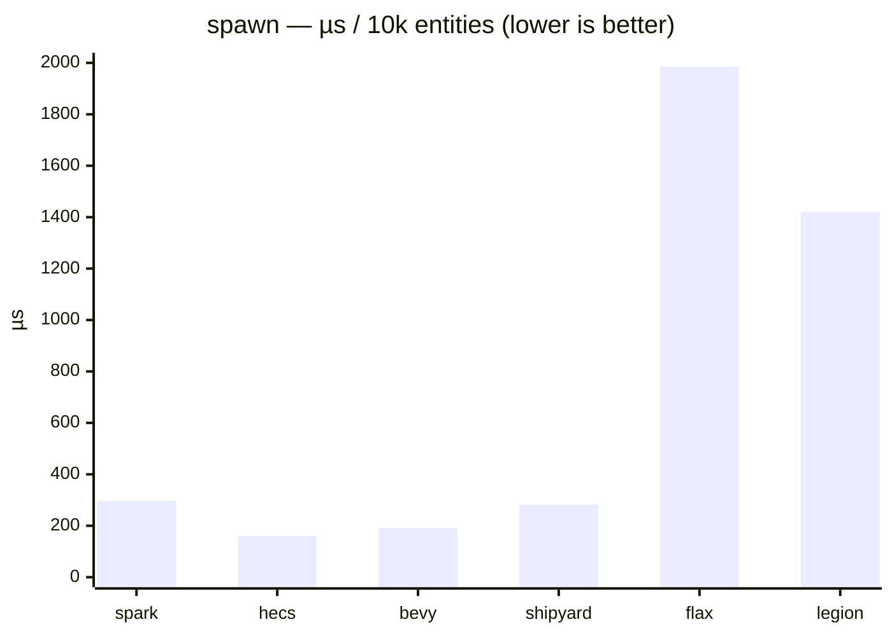
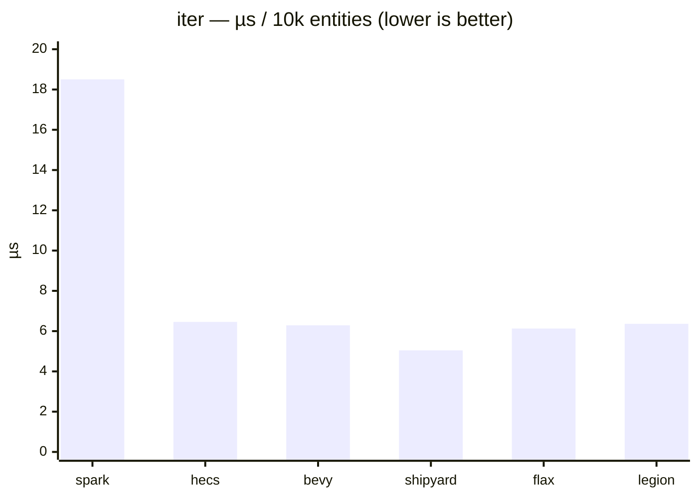
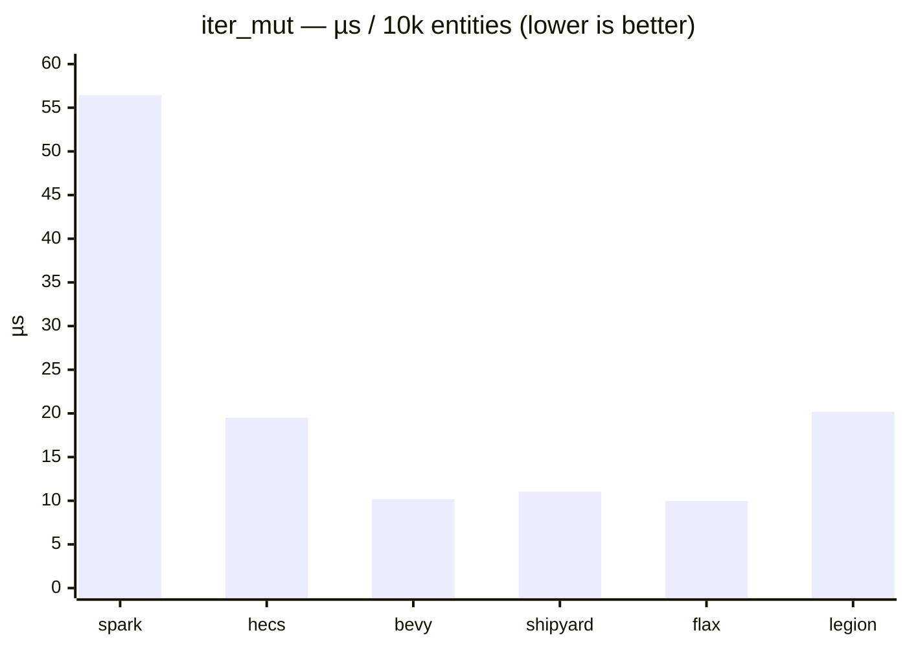
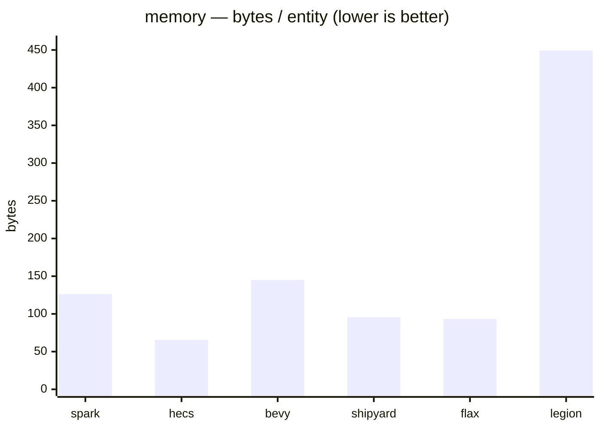
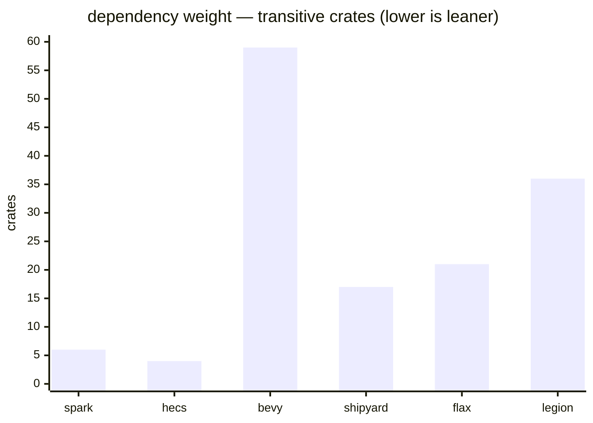
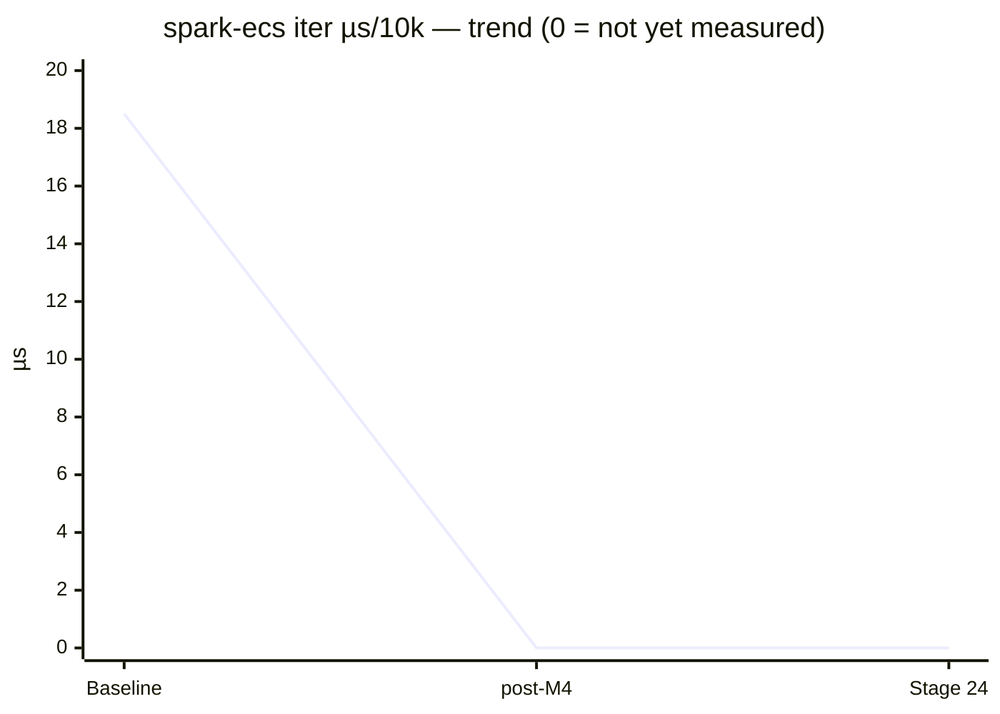

# Baseline 2026-05-31 (post-#62, expanded)

Single-threaded `spark-ecs` at current `main` (`bbb0e5d`, post-PR #62) against
five rival ECS, before M4's Rayon parallelism lands. Four metric axes:
**time**, **throughput**, **live-heap memory**, and **dependency weight**.

Architecture spread of the field — **sparse-set:** `spark-ecs`, `shipyard` ·
**archetype:** `bevy_ecs`, `hecs`, `flax`, `legion`.

Each timing bench is one full pass over **10 000 entities** (`Position` +
`Velocity`); numbers are **µs per pass** (not per-entity). Three separate
`cargo bench` launches; table shows the median point estimate with [min–max].
Criterion ran a 1 s warm-up / 3 s window. Captured on an active developer
machine (best-effort quiet, plugged in), not an isolated rig — compare only
against result files sharing this `machine` + `toolchain` block.

## Time (median µs per 10k-entity pass, lower is better)

| Bench      | spark-ecs               | hecs                    | bevy_ecs                | shipyard                | flax                       | legion                     |
| ---------- | ----------------------- | ----------------------- | ----------------------- | ----------------------- | -------------------------- | -------------------------- |
| `spawn`    | 297.12 [288.25–305.64]  | 160.36 [157.97–163.16]  | 190.50 [180.41–206.29]  | 282.71 [279.37–290.73]  | 1985.4 [1969.7–1989.9]     | 1421.1 [1377.7–1438.7]     |
| `iter`     | 18.503 [18.182–18.656]  | 6.4576 [6.2683–6.4613]  | 6.2871 [6.1458–6.3414]  | 5.0457 [5.0423–5.0622]  | 6.1293 [6.0448–6.1800]     | 6.3623 [6.2452–6.4298]     |
| `iter_mut` | 56.449 [55.941–56.566]  | 19.494 [19.344–19.704]  | 10.188 [10.174–10.301]  | 11.039 [10.908–11.080]  | 9.9655 [9.9643–10.032]     | 20.186 [19.948–20.236]     |

## Throughput (entities / µs = Melem/s, higher is better)

| Bench      | spark-ecs | hecs | bevy_ecs | shipyard | flax | legion |
| ---------- | --------- | ---- | -------- | -------- | ---- | ------ |
| `iter`     | 540       | 1548 | 1590     | **1982** | 1631 | 1572   |
| `iter_mut` | 177       | 513  | 982      | 906      | **1004** | 495 |

## Live-heap memory (bytes retained by a 10k-entity world)

Deterministic counting-allocator measurement (`cargo run --bin mem --release
--features external`), not OS RSS — `allocated − freed` around building each
world.

| ECS       | total bytes | bytes/entity |
| --------- | ----------- | ------------ |
| hecs      | 656 184     | **65.6**     |
| flax      | 932 981     | 93.3         |
| shipyard  | 955 644     | 95.6         |
| spark-ecs | 1 261 996   | 126.2        |
| bevy_ecs  | 1 450 044   | 145.0        |
| legion    | 4 491 872   | 449.2        |

## Dependency weight (transitive crates pulled in, incl. the ECS itself)

`cargo tree -e normal` on an isolated single-dep probe per crate. The
stdlib-only design is the point of this axis.

| ECS       | crates |
| --------- | ------ |
| hecs      | **4**  |
| spark-ecs | 6      |
| shipyard  | 17     |
| flax      | 21     |
| legion    | 36     |
| bevy_ecs  | 59     |

## Charts

## Reading the numbers

This is a **diagnostic** baseline, not a scoreboard. Highlights:

- **`iter` (read):** `shipyard` is fastest (5.0 µs) — sparse-set with packed
  storage. `spark-ecs` (18.5 µs) is ~3× the pack; it is also sparse-set but
  iterates via per-component `RefCell` guards and a less cache-dense layout.
  This is the single clearest target for the Stage 24 archetype/packing work.
- **`iter_mut`:** the field clusters at 10–20 µs except `spark-ecs` (56 µs).
  Spark's gap is wider here than on read because every write goes through the
  `Mut<T>` deref-marker (the PR #62 change-tick stamp). **Caveat:** the rivals
  do *not* all stamp on write by default — `hecs`/`legion` have no modification
  tracking, `shipyard`'s default `ViewMut` doesn't track modifications,
  `bevy_ecs`/`flax` do. So `iter_mut` compares each ECS's *default* mutable
  iteration, which is the honest "out of the box" path, not an identical one.
- **`spawn`:** `flax` (1.99 ms) and `legion` (1.42 ms) are an order of
  magnitude slower — both build entities one at a time (`EntityBuilder` /
  `World::push`) with per-entity archetype work. `spark-ecs` (297 µs) sits with
  the sparse-set/append crates.
- **Memory:** `hecs` is leanest (66 B/entity); `legion` heaviest (449 B/entity,
  archetype + entity-location bookkeeping). `spark-ecs` (126 B/entity) is
  mid-pack.
- **Dependency weight:** `spark-ecs` (6 crates) is second only to `hecs` (4),
  versus `bevy_ecs`'s 59. The stdlib-only design holds up.

Numbers *inform* future ECS design issues; per issue #63 non-goals, nothing
here is acted on directly — any optimisation goes through its own design issue.

## Trend (filled in across later result files)

The `post-M4` and `Stage 24` points are **placeholders** — `0` means "not yet
measured", not a real result.

## Notes

- `iter` / `iter_mut` time **traversal only**: world + query/state built
  outside the timed region wherever the borrow model allows. Exceptions, all
  commented at their call sites: `hecs::query_mut` (`&mut World`, re-issued per
  sample) and `flax::Query::borrow` (re-borrowed per sample).
- `iter_mut` includes an `acc += pos.x` read-back per entity (uniform across
  all six ECS) to defeat dead-code elimination of the write path.
- `legion` 0.4.0 is **unmaintained since 2021** — kept as a historical
  reference and a dependency-weight data point, not a live recommendation.
- `shipyard` (Follow-up PR #2 in #63) and the memory / dependency-weight axes
  (Follow-up PR #5) were pulled forward into this baseline by request.
- Rival versions are pinned exactly in `Cargo.lock`; bumps are deliberate and
  noted in a later result file's narrative.
